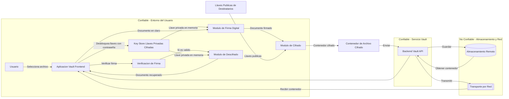

# Bóveda Digital — Frontend (React + Vite) & Backend (Spring Boot + Java 17 + Maven)

Este repositorio contiene dos aplicaciones separadas:

- **Backend**: Spring Boot (Java 17, Maven) — rama `boveda-digital-api/`
- **Frontend**: React + Vite (JavaScript) — rama `boveda-digital-frontend/`

## Roles asignados
- **Aguilar Pérez José Ramón**: Desarrollador de Algoritmos  
- **Carbajal Reyes Irvin Jair**: Project Manager  
- **Gómez Vázquez Juan Pablo**: Desarrollador Frontend  
- **Sánchez Calvillo Saida Mayela**: Testing / QA  

## Canales de comunicación
- Se estará trabajando por medio de llamadas de Google Meet, así como también nos estaremos comunicando por medio de un grupo de WhatsApp en caso de que los integrantes no puedan estar presencialmente.

---

# 🔬 Secure Digital Document Vault - Laboratorio

## 1. System Overview (Descripción General)

### ¿Qué problema resuelve nuestra bóveda?

En un entorno de laboratorio, la integridad de los resultados y la confidencialidad de las fórmulas son críticas. Este sistema evita que documentos sensibles sean leídos por personas no autorizadas o modificados malintencionadamente durante su envío entre investigadores.

### Funcionalidades principales:

- **Cifrado de archivos:** Protege el contenido para que solo el destinatario pueda leerlo.
- **Firmas digitales:** Permite verificar quién envió el documento y que este no ha sido alterado.
- **Gestión de llaves:** Almacena y protege las llaves del usuario mediante una contraseña.
- **Intercambio seguro:** Permite compartir un mismo archivo con múltiples colegas de forma protegida.

### Fuera de alcance:

- Seguridad física de las computadoras del laboratorio.
- Recuperación de archivos si el usuario olvida su contraseña maestra.

---
---

## 2. Diagrama de Arquitectura

### 3. Security Requirements (Requerimientos de Seguridad)

El sistema debe cumplir con las siguientes propiedades:
- **Confidencialidad:** Un atacante que obtenga el contenedor cifrado no podrá leer su contenido sin la llave privada.
- **Integridad:** Cualquier modificación al contenedor cifrado debe ser detectada por el sistema.
- **Autenticidad:** El receptor debe poder verificar la identidad del emisor mediante firmas digitales.
- **Protección de Llaves:** Las llaves privadas deben mantenerse secretas incluso si el almacén de llaves es robado.
- **Detección de Manipulación:** El sistema debe detectar alteraciones en los datos o en sus metadatos.

---

## 4. Modelo de amenazas

Para este sistema de laboratorio, hemos identificado los siguientes elementos a proteger y sus posibles adversarios:
- Assets: Contenidos de experimentos, metadatos (como la fecha de la prueba, quien hizo el documento, dónde), llaves criptográficas, contraseñas de acceso y la validez de las firmas digitales.

- Adversarios: Definimos a un atacante externo con acceso al almacenamiento que busca robar información (ataque pasivo) y a un atacante activo que intenta modificar los resultados o suplantar la identidad de un jefe de laboratorio para validar datos falsos.

El atacante *puede* interceptar los contenedores en tránsito o intentar ataques de fuerza bruta contra las contraseñas, pero *no puede* romper los algoritmos matemáticos fuertes si las llaves se mantienen secretas

---

## 5. Supuestos de Confianza

* Los usuarios eligen contraseñas seguras y no las comparten.
* Las llaves públicas recibidas de otros colegas son auténticas y pertenecen realmente a quienes dicen ser
* El sistema operativo del laboratorio genera números aleatorios seguros para el cifrado.
* El lugar de almacenamiento final (disco duro o nube) es un entorno no confiable donde cualquier atacante podría tener acceso a los archivos cifrados

--- 

## 6. Attack Surface Review (Revisión de Superficie de Ataque)
| Punto de Entrada | Riesgo | Propiedad Afectada |
| :--- | :--- | :--- |
| Entrada de archivos | Archivo malicioso para explotar la app | Integridad |
| Procesamiento de metadatos | Metadatos alterados para engañar al sistema | Integridad |
| Importación de llaves | Usar una llave pública falsa de un atacante | Confidencialidad |
| Ingreso de contraseña | Robo o captura de la contraseña maestra | Confidencialidad de llaves |
| Flujo de envío | Selección errónea de destinatarios | Confidencialidad] |
| Verificación de firma | Omitir o fallar en la validación | Autenticidad |

---

## 7. Design Constraints (Restricciones de Diseño)

Para cumplir con la seguridad, el diseño sigue estas reglas:

| Requerimiento | Decisión de Diseño |
| --- | --- |
| Garantizar Integridad |  *Voy a cifrar* usando métodos que autentican el mensaje. |
| Asegurar Autenticidad |  *Voy a usar firmas digitales* para cada documento. |
| Proteger Llaves Privadas |  *Voy a usar una función de derivación (KDF)* para proteger llaves con contraseña. |
| Verificación de Identidad |  *Voy a usar hash* para asegurar que el archivo no cambió. |

---
