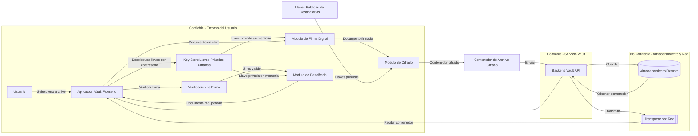

# Bóveda Digital — Frontend (React + Vite) & Backend (Spring Boot + Java 17 + Maven)

Este repositorio contiene dos aplicaciones separadas:

- **Backend**: Spring Boot (Java 17, Maven) — rama `boveda-digital-api/`
- **Frontend**: React + Vite (JavaScript) — rama `boveda-digital-frontend/`

## Roles asignados
- **Aguilar Pérez José Ramón**: Desarrollador de Algoritmos  
- **Carbajal Reyes Irvin Jair**: Project Manager  
- **Gómez Vázquez Juan Pablo**: Desarrollador Frontend  
- **Sánchez Calvillo Saida Mayela**: Testing / QA  

## Canales de comunicación
- Se estará trabajando por medio de llamadas de Google Meet, así como también nos estaremos comunicando por medio de un grupo de WhatsApp en caso de que los integrantes no puedan estar presencialmente.

---

# 🔬 Secure Digital Document Vault - Laboratorio

## 1. System Overview (Descripción General)

### ¿Qué problema resuelve nuestra bóveda?

En un entorno de laboratorio, la integridad de los resultados y la confidencialidad de las fórmulas son críticas. Este sistema evita que documentos sensibles sean leídos por personas no autorizadas o modificados malintencionadamente durante su envío entre investigadores.

### Funcionalidades principales:

- **Cifrado de archivos:** Protege el contenido para que solo el destinatario pueda leerlo.
- **Firmas digitales:** Permite verificar quién envió el documento y que este no ha sido alterado.
- **Gestión de llaves:** Almacena y protege las llaves del usuario mediante una contraseña.
- **Intercambio seguro:** Permite compartir un mismo archivo con múltiples colegas de forma protegida.

### Fuera de alcance:

- Seguridad física de las computadoras del laboratorio.
- Recuperación de archivos si el usuario olvida su contraseña maestra.

---
---

## 2. Diagrama de Arquitectura


```mermaid
flowchart LR

  subgraph TRUSTED_USER[Confiable - Entorno del Usuario]
    direction TB
    U[Usuario]
    UI[Aplicacion Vault Frontend]
    KS[Key Store Llaves Privadas Cifradas]
    SIGN[Modulo de Firma Digital]
    ENC[Modulo de Cifrado]
    VER[Verificacion de Firma]
    DEC[Modulo de Descifrado]
  end

  subgraph TRUSTED_BACKEND[Confiable - Servicio Vault]
    direction TB
    API[Backend Vault API]
  end

  subgraph UNTRUSTED[No Confiable - Almacenamiento y Red]
    direction TB
    ST[(Almacenamiento Remoto)]
    NET[[Transporte por Red]]
  end

  PK[Llaves Publicas de Destinatarios]
  C[Contenedor de Archivo Cifrado]

  %% Flujo de creacion
  U -->|Selecciona archivo| UI
  UI -->|Desbloquea llaves con contraseña| KS
  KS -->|Llave privada en memoria| SIGN
  UI -->|Documento en claro| SIGN
  SIGN -->|Documento firmado| ENC
  PK -->|Llaves publicas| ENC
  ENC -->|Contenedor cifrado| C
  C -->|Enviar| API
  API -->|Guardar| ST
  API -->|Transmitir| NET

  %% Flujo de recepcion
  NET -->|Recibir contenedor| UI
  ST -->|Obtener contenedor| API
  API --> UI
  UI -->|Verificar firma| VER
  VER -->|Si es valido| DEC
  KS -->|Llave privada en memoria| DEC
  DEC -->|Documento recuperado| UI

```

### 3. Security Requirements (Requerimientos de Seguridad)

El sistema debe cumplir con las siguientes propiedades:
- **Confidencialidad:** Un atacante que obtenga el contenedor cifrado no podrá leer su contenido sin la llave privada.
- **Integridad:** Cualquier modificación al contenedor cifrado debe ser detectada por el sistema.
- **Autenticidad:** El receptor debe poder verificar la identidad del emisor mediante firmas digitales.
- **Protección de Llaves:** Las llaves privadas deben mantenerse secretas incluso si el almacén de llaves es robado.
- **Detección de Manipulación:** El sistema debe detectar alteraciones en los datos o en sus metadatos.

---

## 4. Modelo de amenazas

Para este sistema de laboratorio, hemos identificado los siguientes elementos a proteger y sus posibles adversarios:
- Assets: Contenidos de experimentos, metadatos (como la fecha de la prueba, quien hizo el documento, dónde), llaves criptográficas, contraseñas de acceso y la validez de las firmas digitales.

- Adversarios: Definimos a un atacante externo con acceso al almacenamiento que busca robar información (ataque pasivo) y a un atacante activo que intenta modificar los resultados o suplantar la identidad de un jefe de laboratorio para validar datos falsos.

El atacante *puede* interceptar los contenedores en tránsito o intentar ataques de fuerza bruta contra las contraseñas, pero *no puede* romper los algoritmos matemáticos fuertes si las llaves se mantienen secretas


---

## 5. Supuestos de Confianza

* Los usuarios eligen contraseñas seguras y no las comparten.
* Las llaves públicas recibidas de otros colegas son auténticas y pertenecen realmente a quienes dicen ser
* El sistema operativo del laboratorio genera números aleatorios seguros para el cifrado.
* El lugar de almacenamiento final (disco duro o nube) es un entorno no confiable donde cualquier atacante podría tener acceso a los archivos cifrados

--- 

## 6. Attack Surface Review (Revisión de Superficie de Ataque)
| Punto de Entrada | Riesgo | Propiedad Afectada |
| :--- | :--- | :--- |
| Entrada de archivos | Archivo malicioso para explotar la app | Integridad |
| Procesamiento de metadatos | Metadatos alterados para engañar al sistema | Integridad |
| Importación de llaves | Usar una llave pública falsa de un atacante | Confidencialidad |
| Ingreso de contraseña | Robo o captura de la contraseña maestra | Confidencialidad de llaves |
| Flujo de envío | Selección errónea de destinatarios | Confidencialidad] |
| Verificación de firma | Omitir o fallar en la validación | Autenticidad |

---

## 7. Design Constraints (Restricciones de Diseño)

Para cumplir con la seguridad, el diseño sigue estas reglas:

| Requerimiento | Decisión de Diseño |
| --- | --- |
| Garantizar Integridad | <br>*Voy a cifrar* usando métodos que autentican el mensaje. |
| Asegurar Autenticidad | <br>*Voy a usar firmas digitales* para cada documento. |
| Proteger Llaves Privadas | <br>*Voy a usar una función de derivación (KDF)* para proteger llaves con contraseña. |
| Verificación de Identidad | <br>*Voy a usar hash* para asegurar que el archivo no cambió. |

---

## 🌟 Características

✅ **Encriptación de Archivos**
- ChaCha20-Poly1305 para cifrado y autenticación integrados
- Generación automática de claves y nonces criptográficamente seguros
- Interfaz intuitiva con drag & drop

✅ **Desencriptación Segura**
- Validación automática de autenticidad (Poly1305)
- Rechazo de archivos modificados o con clave incorrecta
- Descarga directa del archivo original

✅ **Diseño Moderno**
- Interfaz hermosa con gradientes y animaciones
- Responsive design para móviles y desktops
- Dark-friendly gradient theme

✅ **Gestión de Bandeja**
- Visualización de archivos encriptados recibidos
- Desencriptación bajo demanda
- Descarga segura

## 📋 Estructura del Proyecto

```
src/
├── components/
│   ├── CryptoTool.jsx        # Herramienta principal de encriptación/desencriptación
│   ├── Navigation.jsx         # Navegación superior
│   └── (componentes antiguos eliminados)
├── pages/
│   ├── Dashboard.jsx          # Página principal
│   └── Inbox.jsx              # Bandeja de archivos
├── crypto/
│   ├── chachaEncrypt.js       # Lógica de encriptación/desencriptación
│   ├── dataUtils.js           # Utilidades de conversión de datos
│   └── README.md              # Documentación del módulo crypto
├── services/
│   ├── api.js                 # Cliente HTTP con axios
│   └── fileService.js         # Servicios de archivo
├── styles/
│   ├── CryptoTool.css         # Estilos de herramienta crypto
│   ├── Inbox.css              # Estilos de bandeja
│   ├── Navigation.css         # Estilos de navegación
│   └── App.css                # Estilos globales
└── App.jsx, main.jsx, etc.
```

## 🚀 Inicio Rápido

### Instalación

```bash
npm install
```

### Desarrollo

```bash
npm run dev
```

La aplicación se abrirá en `http://localhost:5173`

### Build para Producción

```bash
npm run build
```

## 📖 Uso

### 1️⃣ Encriptar Archivo

```
1. Ve a la página principal (Encriptar)
2. Arrastra un archivo o haz clic para seleccionar
3. Haz clic en "Encriptar Archivo"
4. Se generarán automáticamente:
   - Archivo cifrado (.encrypted)
   - Clave (hexadecimal)
   - Nonce (hexadecimal)
5. Copia las credenciales y descarga el archivo
```

### 2️⃣ Desencriptar Archivo

```
1. Selecciona un archivo encriptado
2. Haz clic en "Desencriptar Archivo"
3. Ingresa la CLAVE cuando se solicite
4. Ingresa el NONCE cuando se solicite
5. El archivo original se descargará automáticamente
```

### 3️⃣ Recibir Archivos

```
1. Ve a la Bandeja (📬)
2. Visualiza todos los archivos encriptados recibidos
3. Haz clic en "Descargar" para obtener el archivo original
```

## 🔐 Seguridad

### Encryption Design Section

#### Algoritmo AEAD Seleccionado: ChaCha20-Poly1305 IETF

**ChaCha20-Poly1305** es un esquema de Authenticated Encryption with Associated Data (AEAD) que combina dos primitivas criptográficas:

- **ChaCha20**: Cifrado de flujo (stream cipher) que genera una secuencia pseudoaleatoria para cifrar los datos
- **Poly1305**: Código de autenticación basado en MAC que genera una etiqueta de autenticidad

Este algoritmo es considerado **estándar de facto moderno** y es recomendado por IETF (RFC 7539, RFC 8439).

#### Parámetros Criptográficos

| Parámetro | Valor | Descripción |
|-----------|-------|-------------|
| **Tamaño de Clave** | 256 bits (32 bytes) | Clave de encriptación compartida entre remitente y destinatario |
| **Tamaño de Nonce** | 96 bits (12 bytes) | Número único utilizado una sola vez por clave |
| **Tamaño de Tag** | 128 bits (16 bytes) | Código de autenticación que verifica integridad |
| **Recomendación** | FIPS 202, NIST | Considerado criptográficamente seguro |

#### Estrategia de Nonce

El nonce es generado de forma **completamente aleatoria** para cada encriptación:

```javascript
const nonce = sodium.randombytes_buf(
  sodium.crypto_aead_chacha20poly1305_ietf_NPUBBYTES // 12 bytes
);
```

- **Generación**: Usando `randombytes_buf()` de libsodium (CSPRNG - Cryptographically Secure Pseudo-Random Number Generator)
- **Frecuencia**: Un nonce diferente para cada archivo encriptado
- **Garantía**: La probabilidad matemática de repetición con 96-bit random es prácticamente imposible (< 2^-64)

#### Estrategia de Autenticación de Metadatos

Los metadatos del archivo se protegen usando **Additional Associated Data (AAD)**:

```javascript
// Metadatos autenticados pero NO cifrados
const metadata = { fileName, fileSize, version: 1 };
const metadataJson = JSON.stringify(metadata);
const metadataBytes = new TextEncoder().encode(metadataJson);

// Encriptación con AAD
const ciphertext = sodium.crypto_aead_chacha20poly1305_ietf_encrypt(
  fileBuffer,
  metadataBytes,  // ← AAD: autenticado pero no cifrado
  null,
  nonce,
  key
);
```

**Beneficio**: El tag Poly1305 incluye tanto el contenido del archivo **como** los metadatos. Si alguien modifica el nombre o tamaño del archivo, la desencriptación **fallará automáticamente**.

Formato del archivo `.encrypted`:
```
[4 bytes: longitud del header JSON]
[N bytes: header JSON con metadatos (autenticado)]
[12 bytes: nonce]
[M bytes: ciphertext cifrado + 16 bytes Poly1305 tag]
```

### Security Decisions

#### 1️⃣ ¿Por qué AEAD en lugar de Encriptación + Hash?

**Razones técnicas:**

| Aspecto | Encriptación + Hash | AEAD |
|--------|---------------------|------|
| **Complejidad** | 2 operaciones ❌ | 1 operación ✅ |
| **Riesgo de Error** | Alto (puede fallar validación) | Bajo (falsa automáticamente) |
| **Timing Attacks** | Vulnerable 🚨 | Resistente ✅ |
| **Tag Implícito** | No, debe incluirse | Sí, integrado |
| **Verificación Ordenada** | Crítica, fácil de equivocar | Automática ✅ |

**Problema histórico (Encrypt-then-MAC vs others):**
- Históricos implementadores han cometido errores fatales validando MAC después de desencriptar
- Esto puede exponer información del contenido antes de validar autenticidad
- AEAD **fuerza** a validar ambas simultáneamente

**Nuestro caso:**
AEAD garantiza que si el archivo fue modificado (incluso 1 bit), la validación Poly1305 fallará **antes** de retornar cualquier dato desencriptado.

#### 2️⃣ ¿Qué Sucede si el Nonce se Repite?

**Escenario del ataque:**

Si se usa la **misma clave** con el **mismo nonce** dos veces:

1. ChaCha20 genera el **mismo keystream** exacto
2. Ciphertext1 XOR Keystream = Plaintext1
3. Ciphertext2 XOR Keystream = Plaintext2
4. **Ciphertext1 XOR Ciphertext2 = Plaintext1 XOR Plaintext2** ❌

**Riesgo:**
- Los dos plaintexts quedan XOReados, revelando su estructura
- En textos normales, esto puede permitir recuperar parcialmente el contenido
- **CRÍTICO**: Nunca reutilizar (clave, nonce)

**Mitigación en Bóveda Digital:**
- ✅ Nonce generado **aleatoriamente** cada vez (96-bit)
- ✅ Probabilidad de colisión: < 1 en 2^64 operaciones
- ✅ Incluso si se encripta 2^32 archivos, probabilidad de colisión < 0.0001%

**Nota de construcción:** Para máxima seguridad, aplicaciones críticas usan nonces **secuenciales** (contador) con hardware dedicado, pero para encriptación web general, random es aceptable por libsodium.

#### 3️⃣ ¿Contra Qué Atacantes nos Defendemos?

**Perfil de Atacante Defendido:**

| Tipo de Ataque | Defensa | Protección |
|----------------|---------|-----------|
| **Eavesdropping** (escucha de tráfico) | ChaCha20 encriptación |  ✅ Máxima |
| **Modification** (cambio de contenido) | Poly1305 authentication | ✅ Máxima |
| **Metadata Tampering** (modificación de nombre/tamaño) | AAD authentication | ✅ Máxima |
| **Wrong Key Detection** | Tag validation | ✅ Detección automática |
| **Timing Attacks** (información por tiempo) | Constant-time libsodium | ✅ Protegido |

**Atacantes NO defendidos:**

| Ataque | Razón | Mitigation |
|--------|-------|-----------|
| **Key Brute-Force** | 256-bit key space (2^256) | Imposible en tiempo polinomial |
| **Side-Channel local** | Acceso físico a la máquina | Uso de libsodium (constant-time) |
| **Quantum Computing** | Amenaza futura | Considerar Post-Quantum Cryptography en futuro |
| **Keylogger/Malware** | Acceso a sistema operativo | Escapa del alcance de la criptografía |
| **Social Engineering** | Engaño de usuario | Educación del usuario |

**Modelo de Amenaza Asumido:**

✅ Protegemos contra:
- Red insegura (ej: Wi-Fi público)
- Interceptación pasiva
- Modificación accidental o malintencionada
- Archivos interceptados en tránsito o almacenamiento

❌ Suponemos que:
- La clave es secreta y transmitida de forma segura (fuera de banda o HTTPS)
- El dispositivo del usuario no está comprometido
- No hay acceso root/admin al sistema

#### Recomendaciones de Uso Seguro

1. **Compartir claves de forma segura**:
   - No usar el mismo email/chat que el archivo
   - Usar canal secundario (teléfono, mensaje encriptado)
   - Verificar identidad del destinatario

2. **Gestión de claves**:
   - No guardar claves en texto plano
   - No reutilizar claves entre diferentes archivos
   - Eliminar claves después de confirmaciónnoon recepción

3. **Almacenamiento**:
   - Archivos `.encrypted` + claveson seguros en internet
   - Sin clave, el archivo es matemáticamente inutilizable

# Diseño de Firma Digital — Bóveda Digital

## Algoritmo elegido: Ed25519

El sistema utiliza **Ed25519** (Edwards-curve Digital Signature Algorithm sobre Curve25519) implementado a través de [libsodium-wrappers](https://github.com/jedisct1/libsodium.js).

Ed25519 fue elegido por las siguientes razones:

- **Ya disponible** — libsodium es una dependencia existente del proyecto (usada para cifrado ChaCha20-Poly1305 y envoltura de claves X25519). No se requieren bibliotecas adicionales.
- **Rápido y compacto** — Ed25519 produce firmas de 64 bytes y las verifica en microsegundos, incluso en el navegador.
- **Seguridad robusta** — Nivel de seguridad de 128 bits, resistente a ataques de canal lateral y no depende de un nonce aleatorio en el momento de firmar (a diferencia de ECDSA), lo que elimina toda una clase de vulnerabilidades.
- **Separación de responsabilidades** — Las claves de firma Ed25519 se generan de forma independiente a las claves de cifrado X25519 ya existentes en el sistema. Usar pares de claves separados para operaciones distintas (firmar vs. cifrar) es una práctica criptográfica establecida.

Cada usuario tiene dos pares de claves:

| Par de claves | Algoritmo | Propósito |
|---------------|-----------|-----------|
| X25519 | Curve25519 | Envolver la clave simétrica del archivo por destinatario (`crypto_box_seal`) |
| Ed25519 | Edwards25519 | Firmar y verificar contenedores cifrados |

Ambas claves privadas se almacenan juntas en un único archivo cifrado (`username_private_key.encrypted`) que se descarga al registrarse, usando el formato combinado BOV2 protegido con XSalsa20-Poly1305.

---

## Qué datos se firman

La firma cubre el **contenedor cifrado completo** más la **lista de destinatarios**:

```
payload_firmado = SHA-512(encryptedFileBytes || canonicalize(sortedShares))
```

Donde:

- **`encryptedFileBytes`** — el blob cifrado completo producido por `encryptFile()`, con la siguiente estructura interna:

  ```
  [ 4 bytes: longitud del header ]
  [ N bytes: JSON de metadata (AAD) — algorithm, createdAt, fileName, fileSize, version ]
  [ 12 bytes: nonce ChaCha20 ]
  [ M bytes: ciphertext + 16 bytes tag Poly1305 ]
  ```

  Firmar el blob completo significa que la firma cubre implícitamente el ciphertext, el nonce y la metadata autenticada en un solo compromiso.

- **`sortedShares`** — la lista completa de destinatarios, serializada como JSON canónico (RFC 8785) y ordenada por `user_id` de forma ascendente:

  ```json
  [
    { "encrypted_symmetric_key": "...", "user_id": 1 },
    { "encrypted_symmetric_key": "...", "user_id": 2 }
  ]
  ```

  El ordenamiento garantiza determinismo: la misma lista de destinatarios siempre produce los mismos bytes sin importar el orden de inserción.

La firma se almacena en la columna `files.signature` (codificada en hex, 128 caracteres). El firmante se identifica mediante `files.signer_id`, que se usa al momento de verificar para consultar la `signing_public_key` del firmante desde la tabla `users`.

---

## Por qué se requiere un hash antes de firmar

Ed25519 aplica SHA-512 internamente al mensaje antes de calcular la firma. Sin embargo, el sistema aplica un paso explícito de **pre-hash SHA-512** por las siguientes razones:

```
hash = SHA-512(encryptedFileBytes || canonicalize(sortedShares))
firma = Ed25519_sign(hash, signingPrivateKey)
```

1. **Entrada de tamaño fijo** — Sin importar qué tan grande sea el archivo cifrado, la entrada al primitivo de firma siempre son exactamente 64 bytes (el digest SHA-512). Esto hace que el paso de firma sea O(1) en tiempo y memoria respecto al tamaño del archivo, comprometiendo aun así cada bit del contenido.

2. **Compromiso explícito de dominio** — Al concatenar los bytes del archivo y el JSON canónico de destinatarios antes de hashear, un único digest vincula ambas estructuras de datos de forma inseparable. Es computacionalmente inviable encontrar dos pares `(archivo, destinatarios)` distintos que produzcan el mismo hash.

3. **Claridad y auditabilidad** — Hacer el paso de hash explícito en el código (`sodium.crypto_hash(combined)`) hace visible y revisable el contrato de firma, en lugar de depender del comportamiento implícito dentro de la implementación de Ed25519.

---

## Decisiones de seguridad

### ¿Por qué firmar el ciphertext y no el plaintext?

La firma se calcula sobre el **ciphertext cifrado**, no sobre el contenido original del archivo. Esto es un diseño de seguridad deliberado:

1. **El firmante nunca expone el plaintext para firmarlo.** El cifrado ocurre completamente del lado del cliente en el navegador. Si firmar requiriera el plaintext, el paso de firma tendría que ocurrir antes del cifrado, lo que significaría que el plaintext debe permanecer disponible más tiempo del necesario. Firmar el ciphertext permite descartar el plaintext inmediatamente después del cifrado.

2. **La verificación es posible sin descifrar.** Un destinatario puede verificar la autenticidad e integridad de un archivo antes de invertir esfuerzo en descifrarlo. Si la firma es inválida, el descifrado se rechaza inmediatamente — ninguna clave simétrica se aplica sobre un archivo adulterado.

3. **Encrypt-then-Sign es el orden seguro.** La composición segura establecida es: Cifrar → Firmar. Firmar el plaintext primero (Sign-then-Encrypt) permite a un atacante que pueda descifrar eliminar la firma y volver a firmar con su propia clave, suplantando al remitente original. Firmar el ciphertext evita esto porque la firma está vinculada a la salida cifrada específica, no al contenido en claro.

4. **Una clave simétrica comprometida no rompe la autenticidad.** Incluso si un atacante obtuviera la clave simétrica del archivo y pudiera descifrarlo, no podría producir una firma válida sobre contenido modificado sin la clave privada Ed25519 del firmante. Las dos propiedades de seguridad — confidencialidad y autenticidad — están protegidas por material de clave independiente.

---

### ¿Qué ocurre si la firma no se verifica primero?

Si un destinatario descifra un archivo sin verificar la firma primero, los siguientes ataques se vuelven posibles:

| Ataque | Consecuencia |
|--------|-------------|
| **Modificación del ciphertext** | ChaCha20-Poly1305 detectará cambios aleatorios de bits mediante su MAC Poly1305 y lanzará un error de descifrado. Sin embargo, un atacante sofisticado que conozca la clave simétrica podría producir un ciphertext válidamente autenticado con contenido diferente. |
| **Sustitución de metadata** | El contenedor incluye metadata (nombre de archivo, algoritmo, versión) como AAD. Un atacante podría reemplazar el contenedor completo por un archivo diferente cifrado con la misma clave simétrica. Sin verificación de firma, el destinatario no tiene forma de saber que el archivo provino del remitente declarado. |
| **Suplantación de identidad** | Cualquier parte que obtenga la clave simétrica (por ejemplo, un servidor malicioso) podría cifrar contenido arbitrario, subirlo, y el destinatario lo descifraría creyendo que provino del remitente legítimo. |
| **Manipulación de destinatarios** | Sin verificación de firma, un atacante con acceso al servidor podría alterar los registros de `file_shares` — añadiendo destinatarios no autorizados o eliminando legítimos — sin conocimiento del remitente. |

El flujo correcto que impone este sistema es:

```
Descargar archivo cifrado
        ↓
Verificar firma Ed25519  ──→  INVÁLIDA: rechazar, registrar error, no descifrar
        ↓ VÁLIDA
Descifrar clave simétrica (X25519)
        ↓
Descifrar archivo (ChaCha20-Poly1305)
        ↓
Entregar plaintext al usuario
```

Omitir el paso de verificación colapsa la capa de autenticación por completo, reduciendo el sistema a solo confidencialidad — lo cual es insuficiente para un sistema de compartición de archivos donde el origen importa.

---

### ¿Qué ocurre si la metadata se excluye de la firma?

El payload firmado incluye explícitamente la metadata porque excluirla abre varios ataques:

**1. Sustitución del nombre de archivo**
La metadata contiene el `fileName` original. Si la metadata fuera excluida de la firma, un atacante podría cambiar el campo de nombre de archivo en el header del contenedor (que está en plaintext como AAD) sin invalidar la firma. El destinatario vería el contenido correcto del archivo pero con un nombre engañoso — suficiente para causar confusión o ingeniería social en un contexto de compartición de documentos.

**2. Degradación del algoritmo**
La metadata incluye el campo `algorithm` (`"ChaCha20-Poly1305"`). Si fuera excluida, un atacante podría reemplazarlo con un identificador de algoritmo más débil. Un cliente futuro que confiara en ese campo podría ser engañado para usar una ruta de descifrado más débil.

**3. Manipulación de la marca de tiempo**
El campo `createdAt` forma parte de la metadata. Excluirlo permite a un atacante alterar la fecha de creación aparente de un archivo sin romper la firma — útil para falsificación en contextos legales o de auditoría.

**4. Retroceso de versión**
El campo `version` en la metadata permite que el sistema evolucione su formato. Si fuera excluido de la firma, un atacante podría degradar un contenedor a una versión anterior que un cliente maneje de forma diferente, potencialmente explotando diferencias en el parseo.

**5. Autenticación parcial**
ChaCha20-Poly1305 ya autentica la metadata como AAD — lo que significa que la metadata no puede ser alterada sin romper el descifrado. Sin embargo, el MAC Poly1305 está ligado a la clave simétrica, no a la identidad del remitente. Incluir la metadata en la firma Ed25519 extiende la garantía de identidad a la metadata: demuestra no solo que la metadata está intacta, sino que fue establecida por el firmante específico.

En resumen, excluir la metadata de la firma significaría que la firma solo autentica los bytes del ciphertext, dejando las partes visibles en plaintext del contenedor (nombre de archivo, algoritmo, marcas de tiempo) sin vinculación a la identidad del firmante.


---

## 🔑 Gestión de Claves — Actividad D5

Esta sección detalla la implementación de la capa de protección de identidad y el manejo del ciclo de vida de las claves criptográficas en la versión **BOV3**.

### 🛡️ Protección de la Clave Privada: Argon2id
Para la derivación de claves a partir de la contraseña del usuario, el sistema ha migrado de un hash simple (BLAKE2b) a **Argon2id (RFC 9106)**.

* **Resistencia a Fuerza Bruta**: Argon2id está diseñado para ser costoso en memoria y tiempo (`64 MiB` de RAM y `2 iteraciones`), lo que hace inviable el uso de hardware especializado (GPUs/ASICs) para ataques de diccionario.
* **Salting Aleatorio**: Se utiliza un salt de 16 bytes único por cada archivo de claves, impidiendo ataques de tablas precalculadas (Rainbow Tables).
* **Implementación**: Se utiliza la versión WebAssembly de `libsodium-wrappers` para asegurar que el proceso sea constante en tiempo y resistente a ataques de canal lateral.

### 📂 Formato de Contenedor de Claves (BOV3)
Las llaves privadas (X25519 y Ed25519) se exportan en un contenedor binario propietario con el marcador `BOV3`. El flujo de protección es el siguiente:
1. **Derivación**: Contraseña + Salt → Clave de 256 bits (Argon2id).
2. **Cifrado**: Claves Privadas → XSalsa20-Poly1305 (Cifrado autenticado).
3. **Persistencia**: El resultado se descarga como un archivo `.encrypted` que el usuario debe gestionar localmente.

### ⚠️ Modelo Zero-Knowledge y Responsabilidades
El diseño del sistema impone una frontera de confianza donde el servidor es **completamente ciego** a la identidad privada del usuario:

* **Almacenamiento Local**: La aplicación **no guarda copias** de las llaves ni de la contraseña en el servidor.
* **Regla 3-2-1 de Backup**: Se instruye al usuario a mantener 3 copias del archivo de llaves en al menos 2 medios distintos.
* **Irrecuperabilidad**: La pérdida de la contraseña maestra o del archivo `.encrypted` resulta en la pérdida total y permanente de los archivos compartidos, ya que no existe un mecanismo de recuperación centralizado.

### 📈 Evolución del Modelo de Amenazas (D5)

| Amenaza | Mitigación en D5 | Estado |
| :--- | :--- | :--- |
| **Robo de base de datos** | Las claves privadas nunca tocan el servidor; el atacante solo obtiene claves públicas. | ✅ Protegido |
| **Brute-force al KeyStore** | Argon2id impone un retraso de ~1s por intento, haciendo el ataque computacionalmente prohibitivo. | ✅ Protegido |
| **Compromiso de Llave** | Se requiere rotación manual (creación de nueva identidad) al no haber esquema de revocación. | ⚠️ Manual |
| **Suplantación de Identidad** | Las firmas Ed25519 vinculan el archivo a la identidad del emisor de forma matemática. | ✅ Protegido |

> **Nota técnica**: Para consultar la especificación exacta de los bytes del contenedor, los parámetros de KDF y el análisis detallado de riesgos, refiérase al documento de arquitectura [INFO.md](./INFO.md).


## 📦 Dependencias Principales

```json
{
  "react": "^18.x",
  "react-router-dom": "^6.x",
  "axios": "^1.x",
  "libsodium-wrappers": "^0.7.x"
}
```

## 🎨 Temas de Color

- **Primario**: `#667eea` (Azul)
- **Secundario**: `#764ba2` (Púrpura)
- **Éxito**: `#4ade80` (Verde)
- **Error**: `#f5576c` (Rojo)

## 📱 Responsive

- ✅ Desktop (1920px+)
- ✅ Tablet (768px - 1024px)
- ✅ Mobile (< 768px)

## � Debugging

### Consola del Navegador

Si tienes problemas con la desencriptación, abre la consola del navegador (F12) y ejecuta:

```javascript
// Cargar herramientas de debug
import('./src/crypto/debug.js').then(() => {
  // Probar funcionalidad básica
  cryptoDebug.test();
  
  // Probar con datos específicos
  cryptoDebug.roundTrip([72, 101, 108, 108, 111]); // "Hello"
});
```

### Pruebas en la Interfaz

1. Ve a la página principal (Encriptar)
2. Haz clic en "Prueba Básica" o "Prueba Avanzada"
3. Revisa la consola del navegador para logs detallados

### Errores Comunes

- **"invalid public_nonce length"**: El nonce no tiene 12 bytes (24 caracteres hex)
- **"Longitud de clave inválida"**: La clave no tiene 32 bytes (64 caracteres hex)
- **"Clave debe ser hexadecimal válida"**: La clave contiene caracteres no válidos

### Logs de Debug

Los logs aparecen en la consola del navegador con el prefijo:
- `🔍 Debug decryptFile:` - Detalles de la desencriptación
- `🧪 Probando...` - Resultados de pruebas
- `❌ Error en...` - Errores detallados

## 📄 Licencia

Este proyecto está desarrollado como parte de Bóveda Digital.

## 🤝 Contribuciones

Las contribuciones son bienvenidas. Por favor:

1. Fork el proyecto
2. Crea una rama para tu feature
3. Commit tus cambios
4. Push a la rama
5. Abre un Pull Request

---

**Última actualización**: Marzo 2026  
**Versión**: 1.0.0

